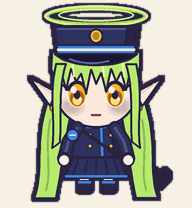
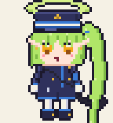
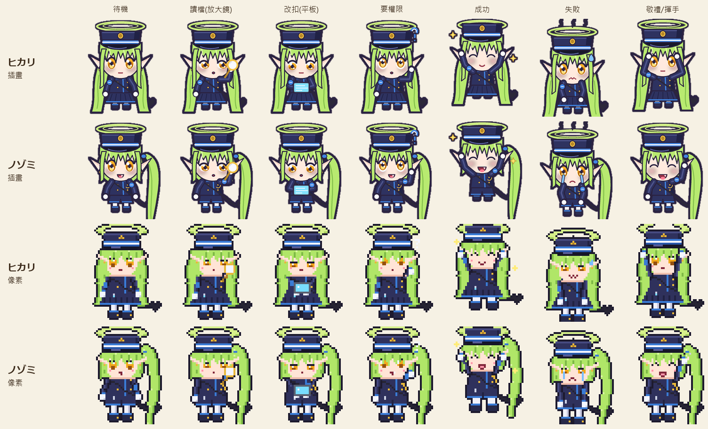
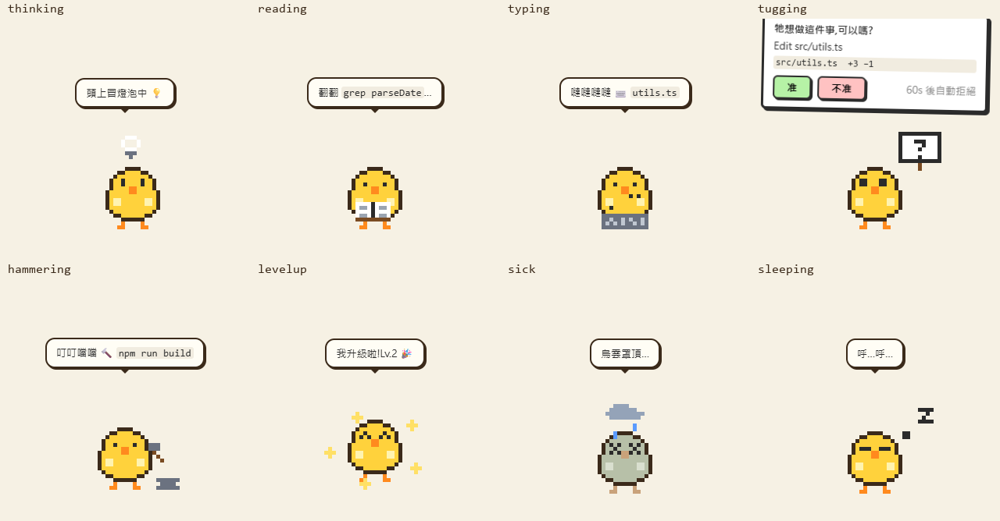
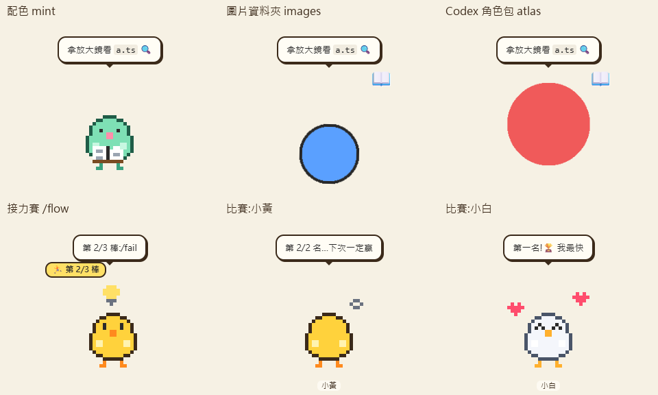

# 🐣 acp-pet: a desktop pet that acts out your coding agent

**English** | [繁體中文](README.zh-TW.md)

A desktop pet that lives on your screen and is secretly a dashboard for an [ACP](https://agentclientprotocol.com) coding agent (Claude Code, Codex, Gemini…). It doesn't chat and it doesn't guess from logs: it consumes the agent's real `session/update` event stream and acts out each event as it happens. Out of the box the pets are Hikari and Nozomi from *Blue Archive* ([below](#meet-hikari--nozomi)); there's also a code-drawn chick, and any Codex pet pack works.

<p align="center">
  
  
</p>
<p align="center"></p>

The built-in chick:



| What the agent is doing | What the chick does |
|---|---|
| Thinking / writing a plan | 💡 a light bulb above its head, pacing |
| `tool_call` read / search | 📖 reading a book |
| `tool_call` edit / delete / move | ⌨️ typing furiously |
| `tool_call` execute | 🔨 hammering on an anvil |
| `tool_call` fetch | 🔭 looking through a telescope |
| `request_permission` | 🪧 runs over holding a sign: **Allow / Deny** (auto-denied after 60 s) |
| Turn succeeded | 💛 jumping with hearts (✨ levels up when it has enough XP) |
| Turn failed | 🤒 turns grey under a rain cloud |
| Permission denied / cancelled | 😤 turns its back on you |
| Idle too long | 💤 bored, then falls asleep |

On top of that there's a small tamagotchi layer. **Energy** drains with every tool call and refills while it sleeps. **Boredom** rises while it's idle, and once it's high enough the chick comes over to ask for a task. Every finished task earns **XP**, and a **streak** of successes adds a bonus. The built-in chick grows a comb at Lv.3 and a crown at Lv.5. Everything is saved to `~/.acp-pet/`.



## Meet Hikari & Nozomi

The two default pets are the Tachibana twins from *Blue Archive*: **Hikari** (calm, deadpan, salutes at the cap) and **Nozomi** (side ponytail, fang grin). Both are drawn entirely from code, with no image generator involved, and each comes in two styles you can switch between under Menu → Looks:

- **Illustrated** (`hikari`, `nozomi`, the default): smooth chibi illustration. `scripts/pets/draw_twins_hd.py` paints every frame at 4× resolution, downsamples it for anti-aliasing, and adds a sticker outline.
- **Pixel** (`hikari-pixel`, `nozomi-pixel`): 48×52 pixel art scaled 4× by `scripts/pets/draw_twins.py`, displayed with sharp nearest-neighbour scaling.

The previews at the top show the illustrated version playing every animation row, then the look-around. The pixel previews are in `docs/pets/*-pixel.gif`.

- They are **Codex pet v2** packs (`pets/<id>/pet.json` + an 8×11 `spritesheet.webp`), the same format as [awesome-codex-pet](https://github.com/legeling/awesome-codex-pet). Both pass that project's official `validate_atlas.py` with no errors.
- v2 packs carry 16 look directions, so while idle the pet **turns to watch your mouse**.
- They work in Codex too: `npm run pets:install-codex` copies them to `~/.codex/pets/`. Then pick one in Codex settings.
- To redraw them after editing the scripts: `npm run pets:draw` (needs Python + Pillow).
- They're fan art; see [ASSETS-LICENSE.md](ASSETS-LICENSE.md). The characters belong to NEXON Games / Yostar, and the sprites are for non-commercial use.

## Quick start

```bash
npm install
npm run demo      # scripted demo turn, no agent needed
npm start         # the real thing
```

- **Click** the chick to pet it. **Double-click** to feed it a task. **Drag** to move it.
- **Right-click** (or the tray icon) for the menu: demo, looks, diary, sleep, add a pet, race, size, always-on-top, read-aloud, wander, quit.
- Things you can type into the task box:

| Input | What happens |
|---|---|
| `fix the failing test` | sent to the real agent |
| `/demo`, `/fail` | scripted turns: a success and a failure |
| `/flow step one >> step two >> step three` | **relay**: legs run one after another in the same session, with a "leg 2/3" badge; stops at the first leg that fails |

## Multiple pets & racing

Menu → **Add a pet** puts another pet on the desktop. Each pet has its own agent, workspace, look and save file. Menu → **Race** sends the same task to every idle pet at once. The first to finish gets 🏆 and 15 bonus XP; the others sulk. To race different agents against each other (Claude vs Codex), give each pet a different `agent` in the config.

## Life on the desktop

Like the classic [Shimeji](https://kilkakon.com/shimeji/), the pets don't just stand still while you're busy with something else:

- They **stroll** back and forth along the bottom of the screen, keeping the height you put them at.
- Two idle pets **walk over to each other and chat** (Hikari and Nozomi have their own twin banter).
- When your mouse comes close, they sometimes **turn to you and say hi**.
- Now and then they **mumble** to themselves.

They stay put while they're working, holding up a permission sign or being dragged, and for a minute after you drop them somewhere. The mouse resting on a pet also keeps it from walking off. Menu → **Wander** turns all of this off (`"wander": false` in the config).

## Looks (skins)

Menu → **Looks** switches a pet's appearance. There are three kinds:

1. **Built-in looks**: Hikari and Nozomi (see above), plus the code-drawn chick in five colors: 小黃雞 (chick), 雪白鴨 (snow), 薄荷史萊姆 (mint), 櫻花雞 (sakura), 夜貓 (night). The chicks come with hand-drawn props (book, keyboard, hammer…).
2. **Your own pictures**: make a folder in `~/.acp-pet/skins/` (Menu → Looks → *Open looks folder*) with one image per pose. PNG, GIF (animated is fine), WebP and JPG all work. Only `idle` is required; missing poses fall back automatically:

   ```
   ~/.acp-pet/skins/my-cat/
   ├── idle.gif        ← required
   ├── working.gif     ← used for thinking / reading / typing / hammering / peeking
   ├── happy.png       ← also used for levelup
   ├── sick.png        ← also used for sulking
   ├── reading.png     ← any pose name overrides the fallback (see the table above)
   └── skin.json       ← optional: { "name": "My cat", "pixelated": true }
   ```

   Picture skins don't have hand-drawn props, so the pet shows a badge (📖 ⌨️ 🔨 🪧 …) and moves (hops, shakes, sways) to say what it's doing.
3. **Codex pet packs**: drop a pet pack folder (`pet.json` + a spritesheet with 192×208 cells; v1 is 8×9, v2 is 8×11) into `~/.acp-pet/skins/`. It works as-is, so the hundreds of pets on [awesome-codex-pet](https://github.com/legeling/awesome-codex-pet) or [OpenPet](https://github.com/dengyie/OpenPet) can be reused. v2 packs also look around at your mouse.

The menu re-scans the folder each time it opens, so new skins show up without restarting. Images over 8 MB, and paths that point outside the skin folder, are refused.

## Configuration

On first launch the app writes `~/.acp-pet/config.json`:

```json
{
  "pets": [
    { "id": "pet1", "name": "ヒカリ", "agent": "claude", "workspace": "C:\\Users\\you\\acp-pet-workspace", "skin": "hikari" }
  ],
  "permissionTimeoutSec": 60,
  "scale": 1,
  "alwaysOnTop": true,
  "tts": false,
  "wander": true
}
```

- `agent` is any [acpx agent name](https://github.com/openclaw/acpx). The agent must already be installed and logged in. For `claude`, acpx fetches the `@agentclientprotocol/claude-agent-acp` adapter automatically.
- `scale` (75%–200%), `alwaysOnTop`, `tts` (read the speech bubbles aloud) and `wander` (stroll and chat on their own) can also be changed from the menu.
- A v0.1 config (`{ "agent", "workspace" }`) is migrated automatically.

## 🔒 Safety

acpx is **not a sandbox**, so the pet applies a few guard rails of its own:

- **Fail-closed permissions**: read, search and think are auto-allowed. Anything else (edit, execute, fetch…) needs you to click **Allow**. No answer within the timeout means denied.
- acpx's client-side fs/terminal callbacks are turned off, so `request_permission`, and therefore the pet's sign, is the only gate.
- Each pet's `workspace` must be a dedicated folder. The app refuses your home directory, a drive root, `~/.ssh`, `~/.aws`, `~/.gnupg`, `~/.config` and `~/.acp-pet`.
- Relay runs are built on the pet's own session rather than acpx's `FlowRunner`, because `FlowRunner` has no permission callback and would bypass the sign.
- For real isolation, run the agent as a separate user or inside a container.

## Architecture

```
acpx runtime ─ AcpRuntimeEvent ─▶ AcpEventNormalizer ─ PetEvent ─▶ PetBrain ─ PetSnapshot ─▶ renderer (sprite / skin)
      ▲                                                                ▲
      └──── onPermissionRequest ──▶ PermissionGate ──── sign ──────────┘ ◀── Allow / Deny
```

| File | Role |
|---|---|
| `src/core/acp-source.ts` | **The only file that touches acpx** (it's pre-1.0, so the coupling stays in one place) |
| `src/core/brain.ts` | State machine + the event → pose mapping + tamagotchi stats; clock-free and deterministic |
| `src/core/permission.ts` | Fail-closed permission gate with timeout |
| `src/core/controller.ts` | Wires one pet together, plus relay runs; Electron-free |
| `src/core/race.ts` | Race referee |
| `src/core/ambient.ts` | Ambient life: decides who strolls, chats or says hi next |
| `src/core/skins.ts` | Skin loading: recolors, picture folders, Codex pet packs (v1 and v2) |
| `src/core/look.ts` | v2 look-around: cursor angle → one of 16 frames |
| `pets/` | Bundled pet packs: Hikari and Nozomi, illustrated and pixel |
| `scripts/pets/draw_twins_hd.py` | Draws the illustrated Hikari and Nozomi sprite sheets |
| `scripts/pets/draw_twins.py` | Draws the pixel versions, and defines the animation rows both styles share |
| `src/core/fake-source.ts` | Scripted turns for `/demo` and `/fail` |
| `src/main/` | Electron: one transparent click-through window per pet, tray, menus, settings |
| `src/renderer/` | Zero-asset pixel sprite, skin rendering, speech bubble, permission sign, TTS |

## Tests

```bash
npm test          # 123 unit + integration tests
npm run smoke     # real Electron app: every pose, all skin types, Hikari & Nozomi with look-around, 150% size, TTS, relay, a two-pet race, ambient strolls and chat (30 checks, screenshots in smoke-out/)
ACP_PET_LIVE=1 npx vitest run test/live.test.ts   # drives a real agent in a temp dir: one turn + a two-leg relay (uses quota)
```

## Credits / prior art

- [acpx](https://github.com/openclaw/acpx): ACP runtime
- [qq-slime-pet](https://github.com/DTSFO/qq-slime-pet): zero-asset canvas pixel sprites and the click-through hit-test trick
- [Shimeji](https://kilkakon.com/shimeji/): the idea of desktop pets that wander and live on their own
- [awesome-codex-pet](https://github.com/legeling/awesome-codex-pet): the Codex pet v2 contract and `validate_atlas.py`
- [OpenPet](https://github.com/dengyie/OpenPet): the Codex pet pack layout
- [codex-has-a-pet-too](https://github.com/ChenxiChu001/codex-has-a-pet-too), [miku-on-desktop](https://github.com/thunguo/miku-on-desktop): other agent pets that inspired this one

## License

Code: MIT. Hikari and Nozomi sprites are Blue Archive fan art for non-commercial use; see [ASSETS-LICENSE.md](ASSETS-LICENSE.md).
